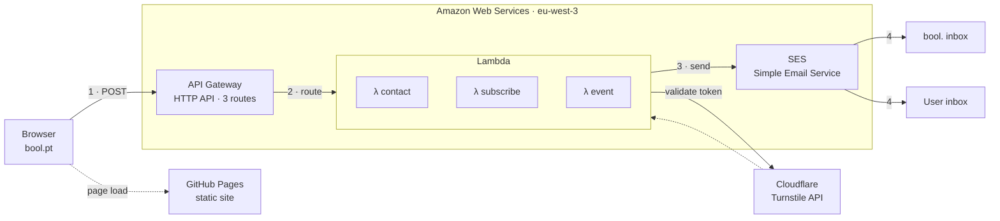

# Bool

Corporate website for Bool, a software consultancy. Built with Astro, React, Shadcn UI, and Tailwind CSS, and deployed to GitHub Pages. Exact dependency versions are pinned once in the pnpm catalog ([pnpm-workspace.yaml](pnpm-workspace.yaml)).

## Architecture

pnpm monorepo with Turborepo orchestration. Static site — zero backend. Contact form hits an external AWS Lambda.

```
apps/
  web/bool/          # Main Astro website (static output)
  web/json-editor/   # React SPA for content editing
packages/
  ui/                # Component library (sections, compositions, primitives)
  content/           # Content collections with Zod validation
  shared/            # Design tokens, utilities, constants
  i18n/              # Internationalization (en; multi-locale ready)
  seo/               # Structured data, meta tags, security headers
  analytics/         # GA4 via Partytown (off main thread)
  compliance/        # GDPR cookie consent management
  api/               # Type-safe API client
  media/             # Image and font assets
  json-editor/       # @bool/json-editor-core — content-editing engine
  test-utils/        # Testing helpers
e2e/                 # @bool/e2e — Playwright end-to-end suite
tooling/
  eslint/            # ESLint configs (base, astro, react)
  prettier/          # Prettier config
  typescript/        # Shared tsconfig presets
  tailwind/          # Tailwind theme from design tokens
  vite/              # Shared Vite configs
  vitest/            # Shared Vitest configs
  commitlint/        # Conventional commit rules
  lighthouse/        # Lighthouse CI budgets
  scripts/           # Repo maintenance scripts (e.g. dep freshness)
```

### Layer Hierarchy

Pages import sections. Sections compose compositions + primitives. Never skip layers.

```
pages → sections → compositions → primitives
```

## Infrastructure

API Gateway · Lambda (×3) · SES · Cloudflare Turnstile · GitHub Pages



### Request flow

1. **Form submit** — Browser POSTs JSON — including a Cloudflare Turnstile token — to API Gateway over HTTPS.
2. **Route to Lambda** — API Gateway forwards `/contact`, `/subscribe`, or `/event` to the matching Lambda function.
3. **Validate & send** — Lambda calls the Cloudflare Turnstile API server-side to verify the token, then calls SES to send two emails.
4. **Email delivery** — SES delivers a notification to the bool. inbox and a confirmation to the user who submitted the form.

## Prerequisites

- Node.js >= 22
- pnpm >= 9

## Getting Started

```bash
# Install dependencies
pnpm install

# Start development server
pnpm dev

# Start json-editor dev server
pnpm dev:json-editor
```

## Scripts

| Command                | Description                      |
| ---------------------- | -------------------------------- |
| `pnpm dev`             | Start Astro dev server           |
| `pnpm dev:json-editor` | Start json-editor dev server     |
| `pnpm build`           | Build all packages and apps      |
| `pnpm lint`            | Run ESLint across all packages   |
| `pnpm typecheck`       | Run TypeScript type checking     |
| `pnpm test`            | Run unit tests (Vitest)          |
| `pnpm test:e2e`        | Run E2E tests (Playwright)       |
| `pnpm format`          | Format all files with Prettier   |
| `pnpm format:check`    | Check formatting                 |
| `pnpm knip`            | Detect dead code and unused deps |
| `pnpm freshness`       | Check a dependency's publish age |

## Environment Variables

All configuration is managed via GitHub repository variables and secrets — no local `.env` files needed. See the **GitHub Variables & Secrets** section in `.claude/CLAUDE.md` for the full reference.

## Deployment

Automated via GitHub Actions. Deploy is triggered manually from Actions > Deploy > Run workflow.

## License

All rights reserved. See [LICENSE](LICENSE).
